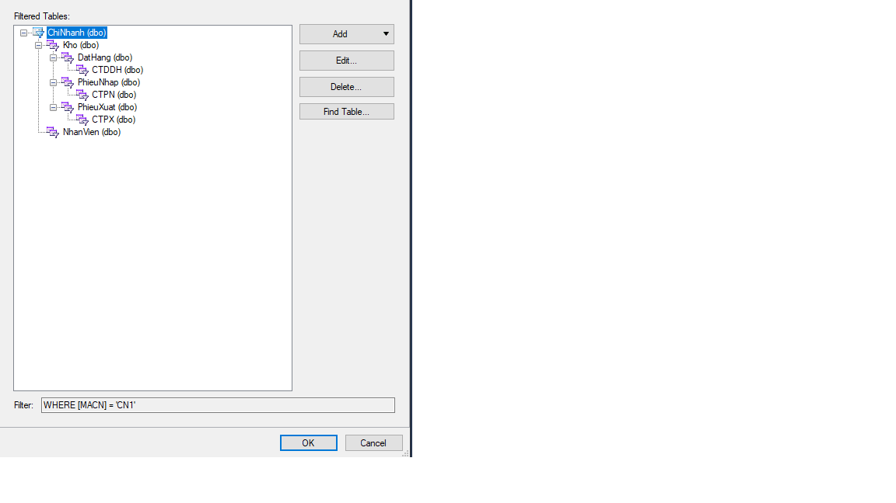

<!DOCTYPE html>
<html lang="vi">
<head>
  <meta charset="UTF-8" />
  <meta name="viewport" content="width=device-width, initial-scale=1.0" />
  <title>README - Quản lý Kho Hàng</title>
</head>
<body>
  <h1>README - Ứng dụng Quản lý Kho Hàng trong Chuỗi Cung Ứng</h1>

  <h2>1. Giới thiệu</h2>
  
Đây là ứng dụng <strong>quản lý kho hàng trong chuỗi cung ứng</strong>, được phát triển bằng <strong>C# và WinForms</strong>. Hệ thống cho phép quản lý vật tư, nhân viên, phiếu nhập/xuất, xuất file báo cáo và hỗ trợ phân quyền theo vai trò: <strong>CONGTY</strong>, <strong>CHINHANH</strong>, <strong>USER</strong>.

  <h2>2. Yêu cầu hệ thống</h2>
  <ul>
    <li>Hệ điều hành: <strong>Windows 10 hoặc 11</strong></li>
    <li>IDE: <strong>Visual Studio Community 2022</strong></li>
    <li>DevExpress: <strong>Phiên bản 24.2 trở lên</strong></li>
    <li>SQL Server: <strong>Phiên bản 2019 hoặc hơn</strong></li>
  </ul>

  <h2>3. Cài đặt</h2>

  <h3>Bước 1: Cài đặt Visual Studio Community 2022</h3>
  <ul>
    <li>Truy cập: <a href="https://visualstudio.microsoft.com/fr/free-developer-offers/">https://visualstudio.microsoft.com/fr/free-developer-offers/</a></li>
    <li>Tải và cài đặt bản Visual Studio Community</li>
  </ul>

  <h3>Bước 2: Cài đặt DevExpress</h3>
  <ul>
    <li>Truy cập: <a href="https://www.devexpress.com/">https://www.devexpress.com/</a></li>
    <li>Tải bản dùng thử 30 ngày và cài đặt</li>
  </ul>

  <h3>Bước 3: Cài đặt SQL Server và SSMS</h3>
  <ul>
    <li>Tải SQL Server Developer: <a href="https://www.microsoft.com/vi-vn/sql-server/sql-server-downloads">SQL Server Downloads</a></li>
    <li>Chạy <code>SQL2019-SSEI-Dev.exe</code>, chọn <strong>Custom</strong> để thêm tính năng <strong>Replication</strong></li>
    <li>Ghi nhớ mật khẩu <code>sa</code> và instance mặc định: <code>MSSQLSERVER</code></li>
    <li>Tải SSMS tại: <a href="https://learn.microsoft.com/en-us/ssms/release-notes-20#202">SSMS 20.2</a></li>
    <li>Cài đặt <code>SSMS-Setup-ENU</code></li>
  </ul>

  <h3>Bước 4: Tạo 3 instance phân mảnh</h3>
  <ul>
    <li>Chạy lại <code>SQL2019-SSEI-Dev.exe</code> và chọn <strong>Custom</strong> để cài thêm</li>
    <li>Đặt tên các instance: <code>CHINHANHHCM</code>, <code>CHINHANHHN</code>, <code>KHOVANV</code></li>
  </ul>

  <h3>Bước 5: Tạo Publication và Subscription</h3>
  <ul>
    <li>Cấu hình <strong>Replication</strong> cho từng instance</li>
    <li>Tạo <strong>Publication</strong> cho mỗi instance</li>
    <li>Tạo <strong>Subscription</strong> để phân tán dữ liệu</li>
    <li>Chọn bảng và stored procedure muốn phân tán</li>
    <li>Thiết lập điều kiện phân tán</li>
    
  </ul>

  <h3>Bước 6: Tạo Linked Server</h3>
  <ul>
    <li><code>LINK0</code>: đến <code>KHOVANV</code></li>
    <li><code>LINK1</code>: đến phân mảnh còn lại</li>
    <li><code>LINK2</code>: đến phân mảnh gốc</li>
  </ul>

  <h3>Bước 7: Phân quyền người dùng</h3>
  <ul>
    <li><code>db_datareader</code>: CONGTY, USER</li>
    <li><code>db_writer</code>: USER</li>
    <li><code>db_owner</code>: CHINHANH</li>
  </ul>

  <h3>Bước 8: Lấy mã nguồn dự án</h3>
  <pre><code>git clone https://github.com/QuyenNDD/QLCCU/tree/master</code></pre>

  <h3>Bước 9: Chạy dự án</h3>
  <ul>
    <li>Mở Visual Studio → Open Project → chọn file <code>.sln</code></li>
    <li>Nhấn <strong>Start</strong> hoặc <code>F5</code> để chạy</li>
  </ul>

  <h2>4. Tài khoản thử nghiệm</h2>
  <table border="1" cellpadding="5">
    <thead>
      <tr>
        <th>Vai trò</th>
        <th>Tài khoản</th>
        <th>Mật khẩu</th>
        <th>Chi nhánh</th>
      </tr>
    </thead>
    <tbody>
      <tr><td>CHINHANH</td><td>Ha</td><td>123456</td><td>Hà Nội</td></tr>
      <tr><td>CHINHANH</td><td>Trang</td><td>123456</td><td>Hồ Chí Minh</td></tr>
    </tbody>
  </table>

  <h2>5. Tác giả</h2>
  <ul>
    <li>Họ và tên: <strong>Nguyễn Đức Đoàn Quyền</strong></li>
    <li>Email: <a href="mailto:n22dccn067@student.ptithcm.edu.vn">n22dccn067@student.ptithcm.edu.vn</a></li>
    <li>Ngày cập nhật: <strong>10/06/2025</strong></li>
  </ul>
</body>
</html>
